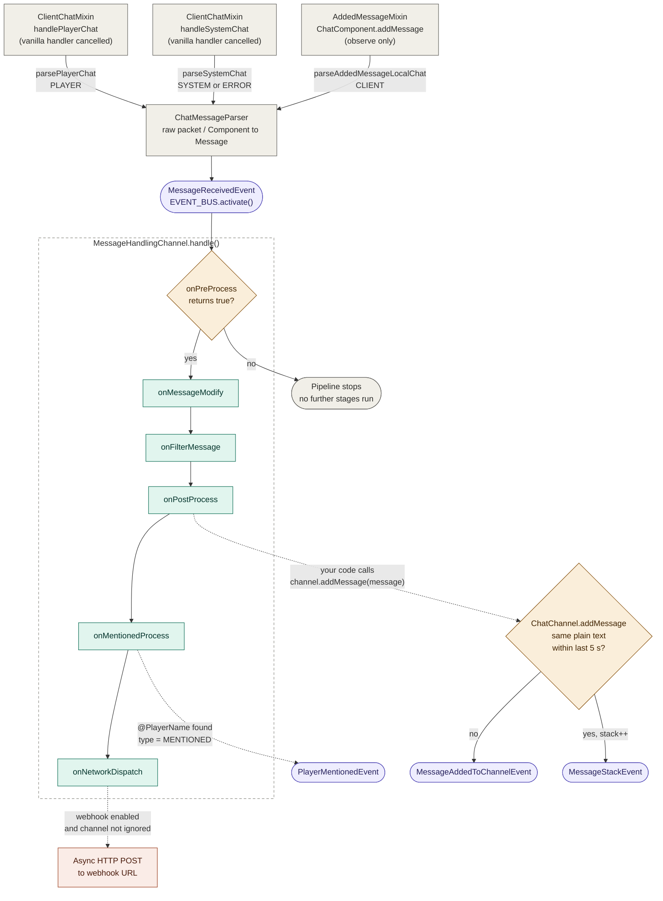
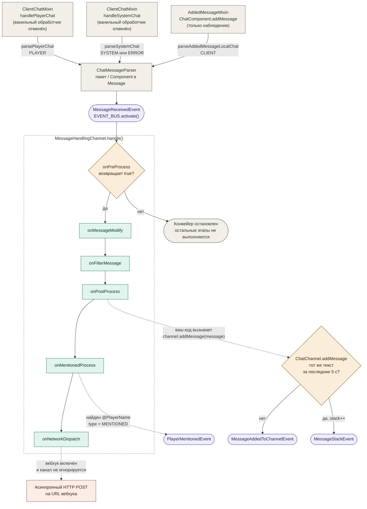

# ChatManager-Core

**ChatManager-Core** is a lightweight, event-driven chat library for Minecraft (Fabric / NeoForge, Minecraft 1.21.4 and 26.2). It hooks into the client chat pipeline and turns raw chat/system messages into a structured, extensible event system — so other mods and modules don't need to touch mixins or parse vanilla chat packets themselves.

Instead of reading raw `Component` objects off the network, other parts of your mod simply subscribe to typed events like `MessageReceivedEvent`, `PlayerMentionedEvent`, or `MessageAddedToChannelEvent` and react to them.

> Русская версия документации находится [в конце файла](#русская-версия).

## Features

- **Custom event bus** (built on [MegaEvents](https://github.com/Ferra13671/MegaEvents)) for all chat-related events — no vanilla mixin juggling required outside the core module.
- **Chat channels** — group messages into named channels (`ChatChannel`) with their own history, visibility, and metadata, similar to tabbed chat systems.
- **Message parsing** — converts vanilla player chat, system chat, and locally-added chat messages into a unified `Message` model (`ChatMessageParser` / `DefaultMessage`), including plain text extraction and message type classification (`PLAYER`, `SYSTEM`, `CLIENT`, `ERROR`, `MENTIONED`, `ANIMATED`, `CUSTOM`).
- **Message pipeline** — `MessageHandlingChannel` provides overridable hooks (`onPreProcess`, `onMessageModify`, `onFilterMessage`, `onPostProcess`, `onMentionedProcess`, `onNetworkDispatch`) to intercept and transform messages as they flow through the system. **Note:** this pipeline does not add the message to a `ChatChannel` for you — call `channel.addMessage(message)` yourself (typically inside `onPostProcess`) once you've decided which channel it belongs to.
- **Mention detection** — automatically detects when a message mentions the local player and fires `PlayerMentionedEvent`.
- **Message stacking** — when the same message is added to a channel twice in quick succession via `ChatChannel#addMessage`, it's automatically stacked (like vanilla's "Message x2") and a `MessageStackEvent` is fired instead of a duplicate `MessageAddedToChannelEvent`.
- **Webhook dispatch** — optional per-channel or global webhook support to forward chat messages to an external HTTP endpoint (e.g. Discord-style webhooks), with either raw JSON `Component` or clean plain-text payloads. Per-channel webhook resolution relies on the message being associated with a channel via `message.setChannel(...)` — this association isn't done automatically by the core pipeline.
- **GIF messages** — chat text containing a `:name-with-dash:` or `:<15-19 digit id>:` token (`ChatManagerCore.GIF_PATTERN`) is marked as `MessageType.ANIMATED`. The `Gif` module downloads the animation as WebP and converts it to a `.mcanim` file in `ChatManager-Core/cache/`.
- **Offline speech-to-text** — `SpeechToText` records from the default microphone and recognizes speech locally with [Vosk](https://alphacephei.com/vosk/). Models are downloaded on demand into `ChatManager-Core/language_models/`, progress and results are reported through `Vosk*Event`s, and a small on-screen indicator shows the listening state.
- **Gameplay events** — `PlayerDeathEvent` (with the block coordinates of the death) and `SendPosEvent` (fired when you send a chat message while aliases are enabled).
- **Password masking** — arguments of `/login`, `/register` and `/changepassword` (and their short aliases) are rendered as `*` in the chat input.
- **Multi-version support** — one `common` module plus per-version modules (`fabric/<mc>`, `neoforge/<mc>`); Minecraft API differences are hidden behind the `utils.compat` interfaces and providers.
- **Configuration** — behavior like time formatting, webhooks, channel settings, message filters/highlighting, color remapping, aliases, macros, math and voice settings is all configurable through auto-generated JSON5 config files via `ChatConfigManager`.
- **Tick & timer utilities** — a simple `TickCounter` that emits a `SecondElapsedEvent` once per second, useful for time-based chat logic (auto-scroll, fading messages, etc.).

## How it works

1. A vanilla chat packet (player message, system message, or a message added directly to the chat HUD) arrives and is intercepted via mixins.
2. `ChatMessageParser` converts it into a `Message` object — extracting plain text, author, timestamp, and message type.
3. `ChatManagerCore.EVENT_BUS` fires a `MessageReceivedEvent`.
4. Any registered `MessageHandlingChannel` (or subclass you create) picks up the event and runs it through the processing pipeline: pre-processing → modification → filtering → post-processing → mention detection → network dispatch.
5. It's up to your `onPostProcess` (or equivalent) implementation to assign the message to a `ChatChannel` by calling `channel.addMessage(message)`. The channel then stores it in its history and fires `MessageAddedToChannelEvent` — or `MessageStackEvent` if it's a duplicate posted within the last 5 seconds.

Everything is decoupled through the event bus, so you can plug in your own logic at almost any stage without touching the core module's internals — but routing a message to a specific channel is a step you implement, not something the core does for you out of the box.

## Message pipeline



| Color | Meaning |
|-------|---------|
| Gray | Entry points, parsing |
| Teal | Overridable pipeline hooks |
| Purple | Events fired on `EVENT_BUS` |
| Amber | Decisions |
| Coral | External side effects |

Notes:

- Messages whose text matches `GIF_PATTERN` get type `ANIMATED` in the mixin, right after parsing (player and system chat only).
- `onPreProcess` is the only hook that can stop the pipeline; returning `false` skips every later stage, including `onNetworkDispatch`.
- The core never calls `channel.addMessage(message)` for you. Do it yourself, typically in `onPostProcess`.

## Installation

ChatManager-Core is published via [JitPack](https://jitpack.io/).

### 1. Add the JitPack repository

**Groovy (`build.gradle`):**

```groovy
repositories {
    maven { url 'https://jitpack.io' }
}
```

**Kotlin (`build.gradle.kts`):**

```kotlin
repositories {
    maven { url = uri("https://jitpack.io") }
}
```

### 2. Add the dependency

Pick the artifact that matches your loader and Minecraft version:

| Loader   | Minecraft | Artifact                                                        |
|----------|-----------|-----------------------------------------------------------------|
| Fabric   | 1.21.4    | `com.github.SakaPati.ChatManager-Core:chatmanager_core-fabric-1.21.4:1.2.0`   |
| Fabric   | 26.2      | `com.github.SakaPati.ChatManager-Core:chatmanager_core-fabric-26.2:1.2.0`     |
| NeoForge | 1.21.4    | `com.github.SakaPati.ChatManager-Core:chatmanager_core-neoforge-1.21.4:1.2.0` |
| NeoForge | 26.2      | `com.github.SakaPati.ChatManager-Core:chatmanager_core-neoforge-26.2:1.2.0`   |

**Fabric example:**

```groovy
dependencies {
    modImplementation 'com.github.SakaPati.ChatManager-Core:chatmanager_core-fabric-1.21.4:1.2.0'
}
```

**NeoForge example:**

```groovy
dependencies {
    implementation 'com.github.SakaPati.ChatManager-Core:chatmanager_core-neoforge-1.21.4:1.2.0'
}
```

Replace the version with a specific [release tag](https://github.com/SakaPati/ChatManager-Core/releases) if you need another one.

## Basic usage

### Listening for chat events

```java
import com.ferra13671.megaevents.eventbus.EventSubscriber;
import ru.fozeton.chatmanager.ChatManagerCore;
import ru.fozeton.chatmanager.events.MessageReceivedEvent;
import ru.fozeton.chatmanager.events.PlayerMentionedEvent;

public class MyChatListener {

    public MyChatListener() {
        ChatManagerCore.EVENT_BUS.register(this);
    }

    @EventSubscriber(event = MessageReceivedEvent.class)
    public void onMessageReceived(MessageReceivedEvent event) {
        System.out.println("New message: " + event.getMessage().getPlainText());
    }

    @EventSubscriber(event = PlayerMentionedEvent.class)
    public void onMentioned(PlayerMentionedEvent event) {
        System.out.println("You were mentioned by: " + event.getAuthor());
    }
}
```

### Creating a custom chat channel

```java
import ru.fozeton.chatmanager.channel.ChatChannel;

// Registers itself with ChatManagerCore automatically
ChatChannel guildChannel = new ChatChannel("guild", "Guild Chat");
```

### Extending the message pipeline

```java
import ru.fozeton.chatmanager.channel.ChatChannel;
import ru.fozeton.chatmanager.channel.MessageHandlingChannel;
import ru.fozeton.chatmanager.messages.Message;

public class MyMessageChannel extends MessageHandlingChannel {

    private final ChatChannel channel = new ChatChannel("guild", "Guild Chat");

    @Override
    protected boolean onPreProcess(Message message) {
        // Return false to drop the message entirely
        return !message.getPlainText().contains("badword");
    }

    @Override
    protected void onMessageModify(Message message) {
        // Mutate message content/style before it reaches chat
    }

    @Override
    protected void onPostProcess(Message message) {
        // The core pipeline does not add messages to a channel for you —
        // you decide where each message ends up.
        message.setChannel(channel);
        channel.addMessage(message);
    }
}
```

## Usage examples

The core only provides the events, models and helpers; what to do with them is up to your mod. It initializes itself through its own mod entrypoint, so you only have to register listeners and channels. Declare the dependency in your mod metadata (mod id `chatmanager_core`), for example in `fabric.mod.json`:

```json
"depends": {
  "chatmanager_core": "*"
}
```

All snippets below are client-side. Events are delivered through `ChatManagerCore.EVENT_BUS`; any object with `@EventSubscriber` methods must be registered once with `EVENT_BUS.register(this)`.

### Working with a `Message`

```java
@EventSubscriber(event = MessageReceivedEvent.class)
public void onMessage(MessageReceivedEvent event) {
    Message message = event.getMessage();

    message.getId();            // random UUID
    message.getAuthor();        // nullable: system and local messages have no author
    message.getPlainText();     // text without formatting
    message.getType();          // PLAYER, SYSTEM, CLIENT, ERROR, MENTIONED, ANIMATED, CUSTOM
    message.getTimestamp();     // java.time.Instant
    message.getContent();       // current Component (what will be shown)
    message.getMutContent();    // editable copy of the original Component

    // Free-form data travels with the message
    message.getMetadata().put("source", "my-mod");

    // Make the message clickable (ClickEvent.Action comes from Minecraft)
    message.setClickEvent(ClickEvent.Action.SUGGEST_COMMAND, "/msg " + message.getAuthor() + " ");
}
```

### Minimal pipeline: drop, edit, route

A `MessageHandlingChannel` subscribes itself to `MessageReceivedEvent` in its constructor, so you only need to create an instance once (for example in your mod initializer). Every instance runs on every message.

```java
public class MyPipeline extends MessageHandlingChannel {
    private final ChatChannel global = new ChatChannel("global", "Global");
    private final ChatChannel system = new ChatChannel("system", "System");

    @Override
    protected boolean onPreProcess(Message message) {
        // false = drop the message, no later stage runs
        return !message.getPlainText().isBlank();
    }

    @Override
    protected void onMessageModify(Message message) {
        // Replace the displayed content; plainText and originalContent stay untouched
        message.setContent(Component.literal("[mod] ").append(message.getMutContent()));
    }

    @Override
    protected void onPostProcess(Message message) {
        ChatChannel target = switch (message.getType()) {
            case SYSTEM, ERROR -> system;
            default -> global;
        };
        message.setChannel(target);   // also needed for per-channel webhooks
        target.addMessage(message);   // fires MessageAddedToChannelEvent or MessageStackEvent
    }
}

// somewhere in your initializer
new MyPipeline();
```

### Reacting to channel events

```java
public class ChannelListener {
    public ChannelListener() {
        ChatManagerCore.EVENT_BUS.register(this);
    }

    @EventSubscriber(event = MessageAddedToChannelEvent.class)
    public void onAdded(MessageAddedToChannelEvent event) {
        System.out.println(event.getChannel().getName() + ": " + event.getMessage().getPlainText());
    }

    @EventSubscriber(event = MessageStackEvent.class)
    public void onStacked(MessageStackEvent event) {
        // the same text arrived again within 5 seconds
        System.out.println(event.getMessage().getPlainText() + " x" + event.getMessage().getStack());
    }

    @EventSubscriber(event = ChannelAddedEvent.class)
    public void onChannel(ChannelAddedEvent event) {
        System.out.println("New channel: " + event.getChannel().getId());
    }
}
```

Channels can be tuned and read back at any time:

```java
ChatChannel channel = ChatManagerCore.getChannels().get("global");
channel.setMaxHistoryMessage(500);
channel.forEachMessage(messages -> messages.forEach(m -> System.out.println(m.getPlainText())));
channel.clear();
```

### Replacing the message parser

`ChatMessageParser` converts packets into `Message` objects. Extend `DefaultMessage` and override only what you need:

```java
public class MyParser extends DefaultMessage {
    @Override
    public Message parseSystemChat(ClientboundSystemChatPacket packet) {
        Message message = super.parseSystemChat(packet);
        if (message.getPlainText().startsWith("[Shop]")) message.setType(MessageType.CUSTOM);
        return message;
    }
}

ChatManagerCore.setMessageParser(new MyParser());
```

### Mentions and lifecycle events

```java
@EventSubscriber(event = PlayerMentionedEvent.class)
public void onMention(PlayerMentionedEvent event) {
    // fired from onMentionedProcess when the text contains "@YourName"
    System.out.println("Mentioned by " + event.getAuthor());
}

@EventSubscriber(event = ClientLogin.class)
public void onLogin(ClientLogin event) { /* joined a server */ }

@EventSubscriber(event = SecondElapsedEvent.class)
public void everySecond(SecondElapsedEvent event) { /* roughly once per second */ }

@EventSubscriber(event = PlayerDeathEvent.class)
public void onDeath(PlayerDeathEvent event) {
    System.out.printf("Died at %.0f %.0f %.0f%n", event.getX(), event.getY(), event.getZ());
}
```

### GIF messages

A message whose text contains something like `:funny-cat:` has type `ANIMATED`. Use `ChatManagerCore.GIF_PATTERN` to extract the id and `Gif` to fetch it. `search` and `trending` perform HTTP requests synchronously, so call them off the render thread.

```java
@EventSubscriber(event = MessageReceivedEvent.class)
public void onGif(MessageReceivedEvent event) {
    Message message = event.getMessage();
    if (message.getType() != MessageType.ANIMATED) return;

    Matcher matcher = ChatManagerCore.GIF_PATTERN.matcher(message.getPlainText());
    if (!matcher.find()) return;

    String gifId = matcher.group(1);
    Gif gif = Gif.getInstance();

    if (gif.existsGif(gifId + ".mcanim")) {
        // already cached in ChatManager-Core/cache/
    } else {
        gif.download(gifId).thenAccept(ok -> {
            if (ok) System.out.println("Cached " + gifId);
        });
    }
}

// Browsing (24 items per page, `getData().getData()` is the list)
GifsResponse trending = Gif.getInstance().trending();
GifsResponse found = Gif.getInstance().search("cat", 1);
```

The core only downloads and converts animations; drawing them in the chat is up to your mod.

### Speech-to-text

```java
public class VoiceInput {
    private static final SpeechToText.Language LANGUAGE = SpeechToText.Language.ENGLISH_US_SMALL;

    public VoiceInput() {
        ChatManagerCore.EVENT_BUS.register(this);
    }

    public void start() {
        if (!SpeechToText.isInstalled(LANGUAGE)) {
            SpeechToText.download(LANGUAGE);   // returns immediately, reports via events
            return;
        }
        // loading the model is slow and transcription() blocks until the phrase ends
        Thread.ofVirtual().start(() -> {
            try {
                SpeechToText.get(LANGUAGE).transcription();
            } catch (Exception e) {
                e.printStackTrace();
            }
        });
    }

    @EventSubscriber(event = VoskModelDownloadSuccessEvent.class)
    public void onDownloaded(VoskModelDownloadSuccessEvent event) { start(); }

    @EventSubscriber(event = VoskModelDownloadFailedEvent.class)
    public void onFailed(VoskModelDownloadFailedEvent event) { event.getException().printStackTrace(); }

    @EventSubscriber(event = VoskPartialResultEvent.class)
    public void onPartial(VoskPartialResultEvent event) { /* live preview: event.getPartialResult() */ }

    @EventSubscriber(event = VoskResultEvent.class)
    public void onResult(VoskResultEvent event) {
        String text = event.getResult();   // final recognized phrase
    }

    @EventSubscriber(event = VoskNotSupportMicroEvent.class)
    public void onNoMic(VoskNotSupportMicroEvent event) { /* no usable microphone */ }
}
```

The language used by the built-in settings is stored in `voice.json5` as the enum name (`ChatConfigManager.getInstance().getVoiceConfig().getModel()`). Call `SpeechToText.unload()` when the model is no longer needed, because it holds a lot of native memory. `SpeechToText.delete(language)` removes a model from disk and returns `false` while a recording is in progress.

### Math engine

`MathEngine` is a standalone expression evaluator that reads its settings, custom constants and functions from `math.json5`. The core only provides it; where and how to use it is up to your mod:

```java
MathEngine math = MathEngine.getInstance();

double a = math.eval("2 + 2 * 3");        // 8.0
double b = math.eval("area(3;4)");        // 12.0, "area(w;h)=w*h" is in the default config
boolean ok = math.isValid("2 + (3 * 4");  // false for NaN/Infinity or a parse error
```

### Reading and changing configs

```java
ChatConfigManager configs = ChatConfigManager.getInstance();

AliasConfig aliases = configs.getAliasConfig();
aliases.getAliases().add(new AliasConfig.Alias("!home", "/home"));
configs.save(AliasConfig.class);

ChannelsConfig channels = configs.getChannelsConfig();
boolean timestamps = channels.isUseTimeFormatter();

configs.reload(AliasConfig.class);   // re-read the file from disk
```

Available getters: `getChannelsConfig`, `getMessagesFilterConfig`, `getRemapperConfig`, `getAliasConfig`, `getTextStyleConfig`, `getMacrosConfig`, `getMathConfig`, `getVoiceConfig`.

## Configuration

Configuration files are generated automatically on first run inside your game's config folder, under `ChatManager-Core/`, as JSON5 (`*.json5`). Available config files:

- **`channels.json5`** — time formatting, per-channel webhook settings, scroll/blink colors, and global webhook configuration.
- **`messagesFilter.json5`** — regex or plain-text message filters, each with its own highlight/border color.
- **`colorRemapper.json5`** — remaps vanilla chat colors to a custom palette, plus saturation/brightness tuning for colors without an explicit override.
- **`alias.json5`** — chat command/message aliases.
- **`macros.json5`** — reusable chat macros.
- **`aiStyleText.json5`** — optional AI-assisted message styling via a Groq-compatible API endpoint.
- **`math.json5`** — settings for `MathEngine`: radians vs degrees, number format, custom constants and functions.
- **`voice.json5`** — speech-to-text model (default `RUSSIAN_SMALL`), listening delay and indicator colors.

Configs are loaded and saved through `ChatConfigManager`, which handles JSON (de)serialization automatically — you don't need to manage file I/O yourself.

## Requirements

- Minecraft 1.21.4 (Java 21+) or 26.2 (Java 25)
- Fabric or NeoForge
- Internet access on first launch: the Vosk library (`vosk-0.3.45.jar`) is downloaded from Maven Central into `ChatManager-Core/libs/`
- [MegaEvents](https://github.com/ferra13671) event bus (pulled in transitively)

## Changelog

### 1.2.0

Changes since 1.1.0.

**Added**

- Multi-version support: Minecraft 1.21.4 and 26.2 on both Fabric and NeoForge. Version-specific code lives in `common/versions/<mc>/`, behind the `utils.compat.api` interfaces and `utils.compat.providers`.
- GIF module (`Gif`, `McAnim`) and `MessageType.ANIMATED`.
- Offline speech-to-text module (`SpeechToText`) with the `VoiceConfig`, an on-screen voice indicator, and the events `VoskResultEvent`, `VoskPartialResultEvent`, `VoskModelAbsentEvent`, `VoskModelDownloadSuccessEvent`, `VoskModelDownloadFailedEvent`, `VoskNotSupportMicroEvent`.
- `PlayerDeathEvent` and `SendPosEvent`.
- Password masking for `/login`, `/register`, `/changepassword` in the chat input (`HiddenCommand`).
- `DependencyLoader`, which downloads and loads the Vosk jar at startup.

**Changed**

- `ChatManagerCore.init()` now takes the config folder: `ChatManagerCore.init(Path configFolder)`. It also sets up `getConfigDir()` and `getGameDir()`, which throw `IllegalStateException` if called before `init`.
- The config system moved to Cloth AutoConfig with a Jankson (`.json5`) serializer. Files are now `<name>.json5` inside `ChatManager-Core/`, and the `config.defaults.*` classes were replaced by `IConfig#applyDefaults()`.
- Added `math` and `voice` configs.
- Webhook dispatch no longer requires a loaded world, because component serialization goes through `ComponentSerializerProvider`.
- `Message#setClickEvent` is now implemented through `ClickEventProvider`.
- Chat packet handlers now run on the main thread (`PacketCompatProvider.ensureRunningOnSameThread`).
- Architectury is no longer used.
- Gradle wrapper updated from 8.12.1 to 9.7.0.

**Known limitations**

- The bundled native library for GIF conversion (`mcanim_impl`) is built only for `win32-x86-64` in this release.

## License

Check the [repository](https://github.com/SakaPati/ChatManager-Core?tab=License-1-ov-file) for license details.


---

# Русская версия

**ChatManager-Core** — лёгкая событийная библиотека для чата Minecraft (Fabric / NeoForge, Minecraft 1.21.4 и 26.2). Она подключается к клиентскому конвейеру чата и превращает «сырые» чат/системные сообщения в структурированную расширяемую систему событий, так что другим модам и модулям не нужно трогать миксины и самим разбирать ванильные пакеты чата.

Вместо чтения «сырых» объектов `Component` из сети ваш мод просто подписывается на типизированные события вроде `MessageReceivedEvent`, `PlayerMentionedEvent` или `MessageAddedToChannelEvent` и реагирует на них.

## Возможности

- **Собственная шина событий** (на базе [MegaEvents](https://github.com/Ferra13671/MegaEvents)) для всех событий чата — вне модуля ядра не нужно возиться с ванильными миксинами.
- **Каналы чата** — группировка сообщений по именованным каналам (`ChatChannel`) со своей историей, видимостью и метаданными, как во вкладках чата.
- **Разбор сообщений** — ванильный чат игроков, системный чат и локально добавленные сообщения превращаются в единую модель `Message` (`ChatMessageParser` / `DefaultMessage`) с извлечением обычного текста и определением типа (`PLAYER`, `SYSTEM`, `CLIENT`, `ERROR`, `MENTIONED`, `ANIMATED`, `CUSTOM`).
- **Конвейер сообщений** — `MessageHandlingChannel` даёт переопределяемые хуки (`onPreProcess`, `onMessageModify`, `onFilterMessage`, `onPostProcess`, `onMentionedProcess`, `onNetworkDispatch`), чтобы перехватывать и преобразовывать сообщения по пути через систему. **Важно:** конвейер сам не добавляет сообщение в `ChatChannel` — вызовите `channel.addMessage(message)` самостоятельно (обычно в `onPostProcess`), когда решите, какому каналу оно принадлежит.
- **Определение упоминаний** — автоматически находит сообщения, в которых упомянут локальный игрок, и вызывает `PlayerMentionedEvent`.
- **Склейка сообщений** — если одно и то же сообщение дважды подряд добавляется в канал через `ChatChannel#addMessage`, оно автоматически «стакается» (как «Message x2» в ванили), и вместо дубликата `MessageAddedToChannelEvent` вызывается `MessageStackEvent`.
- **Отправка вебхуков** — необязательная пересылка сообщений чата на внешний HTTP-адрес (например, вебхуки в стиле Discord) для отдельных каналов или глобально; в теле либо JSON `Component`, либо чистый текст. Выбор вебхука канала опирается на связь сообщения с каналом через `message.setChannel(...)` — ядро эту связь само не создаёт.
- **GIF-сообщения** — текст чата с токеном `:name-with-dash:` или `:<id из 15–19 цифр>:` (`ChatManagerCore.GIF_PATTERN`) получает тип `MessageType.ANIMATED`. Модуль `Gif` скачивает анимацию в формате WebP и конвертирует её в файл `.mcanim` в `ChatManager-Core/cache/`.
- **Офлайн-распознавание речи** — `SpeechToText` записывает звук с микрофона по умолчанию и распознаёт речь локально через [Vosk](https://alphacephei.com/vosk/). Модели скачиваются по требованию в `ChatManager-Core/language_models/`, прогресс и результаты приходят через `Vosk*Event`, а небольшой индикатор на экране показывает состояние прослушивания.
- **Игровые события** — `PlayerDeathEvent` (с координатами смерти в блоках) и `SendPosEvent` (вызывается при отправке сообщения в чат, если включены алиасы).
- **Скрытие паролей** — аргументы `/login`, `/register` и `/changepassword` (и их коротких алиасов) отображаются в строке ввода как `*`.
- **Поддержка нескольких версий** — один модуль `common` плюс модули под каждую версию (`fabric/<mc>`, `neoforge/<mc>`); различия в API Minecraft скрыты за интерфейсами и провайдерами `utils.compat`.
- **Конфигурация** — время в сообщениях, вебхуки, настройки каналов, фильтры и подсветка сообщений, переназначение цветов, алиасы, макросы, настройки математики и голоса настраиваются через автоматически создаваемые JSON5-файлы с помощью `ChatConfigManager`.
- **Тики и таймеры** — простой `TickCounter` раз в секунду вызывает `SecondElapsedEvent`; удобно для логики на времени (автопрокрутка, затухание сообщений и т. п.).

## Как это работает

1. Приходит ванильный пакет чата (сообщение игрока, системное сообщение или сообщение, добавленное прямо в HUD чата), и миксины его перехватывают.
2. `ChatMessageParser` превращает его в объект `Message` — достаёт обычный текст, автора, время и тип сообщения.
3. `ChatManagerCore.EVENT_BUS` вызывает `MessageReceivedEvent`.
4. Любой зарегистрированный `MessageHandlingChannel` (или ваш наследник) получает событие и прогоняет сообщение через конвейер: предобработка → изменение → фильтрация → постобработка → поиск упоминаний → отправка в сеть.
5. Назначить сообщение какому-либо `ChatChannel`, вызвав `channel.addMessage(message)`, должна ваша реализация `onPostProcess` (или аналог). Канал сохранит сообщение в истории и вызовет `MessageAddedToChannelEvent` — либо `MessageStackEvent`, если это дубликат, пришедший в течение последних 5 секунд.

Всё связано через шину событий, поэтому свою логику можно встроить почти на любом этапе, не трогая внутренности ядра. Но направить сообщение в конкретный канал — это шаг, который реализуете вы, ядро само его не делает.

## Путь сообщения



| Цвет | Значение |
|------|----------|
| Серый | Точки входа, разбор |
| Бирюзовый | Переопределяемые хуки конвейера |
| Фиолетовый | События, вызываемые на `EVENT_BUS` |
| Янтарный | Проверки и ветвления |
| Коралловый | Внешние побочные эффекты |

Примечания:

- Сообщения, текст которых подходит под `GIF_PATTERN`, получают тип `ANIMATED` в миксине сразу после разбора (только чат игроков и системный чат).
- `onPreProcess` — единственный хук, который может остановить конвейер: если он вернул `false`, все последующие этапы пропускаются, включая `onNetworkDispatch`.
- Ядро никогда не вызывает `channel.addMessage(message)` за вас. Делайте это сами, обычно в `onPostProcess`.

## Установка

ChatManager-Core публикуется через [JitPack](https://jitpack.io/).

### 1. Добавьте репозиторий JitPack

**Groovy (`build.gradle`):**

```groovy
repositories {
    maven { url 'https://jitpack.io' }
}
```

**Kotlin (`build.gradle.kts`):**

```kotlin
repositories {
    maven { url = uri("https://jitpack.io") }
}
```

### 2. Добавьте зависимость

Выберите артефакт под ваш загрузчик и версию Minecraft:

| Загрузчик | Minecraft | Артефакт |
|-----------|-----------|----------|
| Fabric   | 1.21.4 | `com.github.SakaPati.ChatManager-Core:chatmanager_core-fabric-1.21.4:1.2.0`   |
| Fabric   | 26.2   | `com.github.SakaPati.ChatManager-Core:chatmanager_core-fabric-26.2:1.2.0`     |
| NeoForge | 1.21.4 | `com.github.SakaPati.ChatManager-Core:chatmanager_core-neoforge-1.21.4:1.2.0` |
| NeoForge | 26.2   | `com.github.SakaPati.ChatManager-Core:chatmanager_core-neoforge-26.2:1.2.0`   |

**Пример для Fabric:**

```groovy
dependencies {
    modImplementation 'com.github.SakaPati.ChatManager-Core:chatmanager_core-fabric-1.21.4:1.2.0'
}
```

**Пример для NeoForge:**

```groovy
dependencies {
    implementation 'com.github.SakaPati.ChatManager-Core:chatmanager_core-neoforge-1.21.4:1.2.0'
}
```

Если нужна другая версия, замените её на нужный [тег релиза](https://github.com/SakaPati/ChatManager-Core/releases).

## Базовое использование

### Прослушивание событий чата

```java
import com.ferra13671.megaevents.eventbus.EventSubscriber;
import ru.fozeton.chatmanager.ChatManagerCore;
import ru.fozeton.chatmanager.events.MessageReceivedEvent;
import ru.fozeton.chatmanager.events.PlayerMentionedEvent;

public class MyChatListener {

    public MyChatListener() {
        ChatManagerCore.EVENT_BUS.register(this);
    }

    @EventSubscriber(event = MessageReceivedEvent.class)
    public void onMessageReceived(MessageReceivedEvent event) {
        System.out.println("New message: " + event.getMessage().getPlainText());
    }

    @EventSubscriber(event = PlayerMentionedEvent.class)
    public void onMentioned(PlayerMentionedEvent event) {
        System.out.println("You were mentioned by: " + event.getAuthor());
    }
}
```

### Создание своего канала чата

```java
import ru.fozeton.chatmanager.channel.ChatChannel;

// Сам регистрируется в ChatManagerCore
ChatChannel guildChannel = new ChatChannel("guild", "Guild Chat");
```

### Расширение конвейера сообщений

```java
import ru.fozeton.chatmanager.channel.ChatChannel;
import ru.fozeton.chatmanager.channel.MessageHandlingChannel;
import ru.fozeton.chatmanager.messages.Message;

public class MyMessageChannel extends MessageHandlingChannel {

    private final ChatChannel channel = new ChatChannel("guild", "Guild Chat");

    @Override
    protected boolean onPreProcess(Message message) {
        // Верните false, чтобы полностью отбросить сообщение
        return !message.getPlainText().contains("badword");
    }

    @Override
    protected void onMessageModify(Message message) {
        // Измените содержимое или стиль сообщения до того, как оно попадёт в чат
    }

    @Override
    protected void onPostProcess(Message message) {
        // Конвейер ядра сам не добавляет сообщения в канал —
        // вы решаете, куда попадёт каждое сообщение.
        message.setChannel(channel);
        channel.addMessage(message);
    }
}
```

## Примеры использования

Ядро лишь предоставляет события, модели и вспомогательные классы; что с ними делать — решает ваш мод. Оно инициализируется само через собственную точку входа мода, поэтому вам остаётся только зарегистрировать слушателей и каналы. Укажите зависимость в метаданных мода (id мода `chatmanager_core`), например в `fabric.mod.json`:

```json
"depends": {
  "chatmanager_core": "*"
}
```

Все примеры ниже — клиентские. События доставляются через `ChatManagerCore.EVENT_BUS`; любой объект с методами `@EventSubscriber` нужно один раз зарегистрировать через `EVENT_BUS.register(this)`.

### Работа с `Message`

```java
@EventSubscriber(event = MessageReceivedEvent.class)
public void onMessage(MessageReceivedEvent event) {
    Message message = event.getMessage();

    message.getId();            // случайный UUID
    message.getAuthor();        // может быть null: у системных и локальных сообщений нет автора
    message.getPlainText();     // текст без форматирования
    message.getType();          // PLAYER, SYSTEM, CLIENT, ERROR, MENTIONED, ANIMATED, CUSTOM
    message.getTimestamp();     // java.time.Instant
    message.getContent();       // текущий Component (то, что будет показано)
    message.getMutContent();    // изменяемая копия исходного Component

    // Произвольные данные, которые едут вместе с сообщением
    message.getMetadata().put("source", "my-mod");

    // Делаем сообщение кликабельным (ClickEvent.Action из Minecraft)
    message.setClickEvent(ClickEvent.Action.SUGGEST_COMMAND, "/msg " + message.getAuthor() + " ");
}
```

### Минимальный конвейер: отбросить, изменить, разложить по каналам

`MessageHandlingChannel` подписывается на `MessageReceivedEvent` сам, в конструкторе, поэтому достаточно один раз создать экземпляр (например, в инициализаторе мода). Каждый экземпляр обрабатывает каждое сообщение.

```java
public class MyPipeline extends MessageHandlingChannel {
    private final ChatChannel global = new ChatChannel("global", "Global");
    private final ChatChannel system = new ChatChannel("system", "System");

    @Override
    protected boolean onPreProcess(Message message) {
        // false = отбросить сообщение, дальнейшие этапы не выполняются
        return !message.getPlainText().isBlank();
    }

    @Override
    protected void onMessageModify(Message message) {
        // Подменяем отображаемое содержимое; plainText и originalContent не меняются
        message.setContent(Component.literal("[mod] ").append(message.getMutContent()));
    }

    @Override
    protected void onPostProcess(Message message) {
        ChatChannel target = switch (message.getType()) {
            case SYSTEM, ERROR -> system;
            default -> global;
        };
        message.setChannel(target);   // нужно и для вебхуков по каналам
        target.addMessage(message);   // вызовет MessageAddedToChannelEvent или MessageStackEvent
    }
}

// где-нибудь в инициализаторе мода
new MyPipeline();
```

### Реакция на события каналов

```java
public class ChannelListener {
    public ChannelListener() {
        ChatManagerCore.EVENT_BUS.register(this);
    }

    @EventSubscriber(event = MessageAddedToChannelEvent.class)
    public void onAdded(MessageAddedToChannelEvent event) {
        System.out.println(event.getChannel().getName() + ": " + event.getMessage().getPlainText());
    }

    @EventSubscriber(event = MessageStackEvent.class)
    public void onStacked(MessageStackEvent event) {
        // тот же текст пришёл повторно в течение 5 секунд
        System.out.println(event.getMessage().getPlainText() + " x" + event.getMessage().getStack());
    }

    @EventSubscriber(event = ChannelAddedEvent.class)
    public void onChannel(ChannelAddedEvent event) {
        System.out.println("New channel: " + event.getChannel().getId());
    }
}
```

Каналы можно настраивать и читать в любой момент:

```java
ChatChannel channel = ChatManagerCore.getChannels().get("global");
channel.setMaxHistoryMessage(500);
channel.forEachMessage(messages -> messages.forEach(m -> System.out.println(m.getPlainText())));
channel.clear();
```

### Замена парсера сообщений

`ChatMessageParser` превращает пакеты в объекты `Message`. Наследуйтесь от `DefaultMessage` и переопределяйте только то, что нужно:

```java
public class MyParser extends DefaultMessage {
    @Override
    public Message parseSystemChat(ClientboundSystemChatPacket packet) {
        Message message = super.parseSystemChat(packet);
        if (message.getPlainText().startsWith("[Shop]")) message.setType(MessageType.CUSTOM);
        return message;
    }
}

ChatManagerCore.setMessageParser(new MyParser());
```

### Упоминания и игровые события

```java
@EventSubscriber(event = PlayerMentionedEvent.class)
public void onMention(PlayerMentionedEvent event) {
    // вызывается из onMentionedProcess, если в тексте есть "@ВашНик"
    System.out.println("Mentioned by " + event.getAuthor());
}

@EventSubscriber(event = ClientLogin.class)
public void onLogin(ClientLogin event) { /* зашли на сервер */ }

@EventSubscriber(event = SecondElapsedEvent.class)
public void everySecond(SecondElapsedEvent event) { /* примерно раз в секунду */ }

@EventSubscriber(event = PlayerDeathEvent.class)
public void onDeath(PlayerDeathEvent event) {
    System.out.printf("Died at %.0f %.0f %.0f%n", event.getX(), event.getY(), event.getZ());
}
```

### GIF-сообщения

Сообщение, в тексте которого есть что-то вроде `:funny-cat:`, имеет тип `ANIMATED`. Достаньте id через `ChatManagerCore.GIF_PATTERN`, а скачайте анимацию через `Gif`. `search` и `trending` выполняют HTTP-запросы синхронно, поэтому вызывайте их не из потока рендера.

```java
@EventSubscriber(event = MessageReceivedEvent.class)
public void onGif(MessageReceivedEvent event) {
    Message message = event.getMessage();
    if (message.getType() != MessageType.ANIMATED) return;

    Matcher matcher = ChatManagerCore.GIF_PATTERN.matcher(message.getPlainText());
    if (!matcher.find()) return;

    String gifId = matcher.group(1);
    Gif gif = Gif.getInstance();

    if (gif.existsGif(gifId + ".mcanim")) {
        // уже лежит в кеше ChatManager-Core/cache/
    } else {
        gif.download(gifId).thenAccept(ok -> {
            if (ok) System.out.println("Cached " + gifId);
        });
    }
}

// Просмотр (24 элемента на страницу, список лежит в `getData().getData()`)
GifsResponse trending = Gif.getInstance().trending();
GifsResponse found = Gif.getInstance().search("cat", 1);
```

Ядро только скачивает и конвертирует анимации; отрисовка в чате — дело вашего мода.

### Распознавание речи

```java
public class VoiceInput {
    private static final SpeechToText.Language LANGUAGE = SpeechToText.Language.ENGLISH_US_SMALL;

    public VoiceInput() {
        ChatManagerCore.EVENT_BUS.register(this);
    }

    public void start() {
        if (!SpeechToText.isInstalled(LANGUAGE)) {
            SpeechToText.download(LANGUAGE);   // возвращается сразу, результат приходит событиями
            return;
        }
        // загрузка модели медленная, а transcription() блокирует поток до конца фразы
        Thread.ofVirtual().start(() -> {
            try {
                SpeechToText.get(LANGUAGE).transcription();
            } catch (Exception e) {
                e.printStackTrace();
            }
        });
    }

    @EventSubscriber(event = VoskModelDownloadSuccessEvent.class)
    public void onDownloaded(VoskModelDownloadSuccessEvent event) { start(); }

    @EventSubscriber(event = VoskModelDownloadFailedEvent.class)
    public void onFailed(VoskModelDownloadFailedEvent event) { event.getException().printStackTrace(); }

    @EventSubscriber(event = VoskPartialResultEvent.class)
    public void onPartial(VoskPartialResultEvent event) { /* живой предпросмотр: event.getPartialResult() */ }

    @EventSubscriber(event = VoskResultEvent.class)
    public void onResult(VoskResultEvent event) {
        String text = event.getResult();   // итоговая распознанная фраза
    }

    @EventSubscriber(event = VoskNotSupportMicroEvent.class)
    public void onNoMic(VoskNotSupportMicroEvent event) { /* нет подходящего микрофона */ }
}
```

Язык, который используют встроенные настройки, хранится в `voice.json5` как имя элемента enum (`ChatConfigManager.getInstance().getVoiceConfig().getModel()`). Когда модель больше не нужна, вызовите `SpeechToText.unload()`: она занимает много нативной памяти. `SpeechToText.delete(language)` удаляет модель с диска и возвращает `false`, пока идёт запись.

### Математический движок

`MathEngine` — самостоятельный вычислитель выражений, который берёт настройки, пользовательские константы и функции из `math.json5`. Ядро его только предоставляет; где и как его использовать — решает ваш мод:

```java
MathEngine math = MathEngine.getInstance();

double a = math.eval("2 + 2 * 3");        // 8.0
double b = math.eval("area(3;4)");        // 12.0, "area(w;h)=w*h" есть в конфиге по умолчанию
boolean ok = math.isValid("2 + (3 * 4");  // false при NaN/Infinity или ошибке разбора
```

### Чтение и изменение конфигов

```java
ChatConfigManager configs = ChatConfigManager.getInstance();

AliasConfig aliases = configs.getAliasConfig();
aliases.getAliases().add(new AliasConfig.Alias("!home", "/home"));
configs.save(AliasConfig.class);

ChannelsConfig channels = configs.getChannelsConfig();
boolean timestamps = channels.isUseTimeFormatter();

configs.reload(AliasConfig.class);   // перечитать файл с диска
```

Доступные геттеры: `getChannelsConfig`, `getMessagesFilterConfig`, `getRemapperConfig`, `getAliasConfig`, `getTextStyleConfig`, `getMacrosConfig`, `getMathConfig`, `getVoiceConfig`.

## Конфигурация

Файлы конфигурации создаются автоматически при первом запуске в папке конфигов игры, в каталоге `ChatManager-Core/`, в формате JSON5 (`*.json5`). Доступные файлы:

- **`channels.json5`** — форматирование времени, настройки вебхуков по каналам, цвета прокрутки и мигания, глобальный вебхук.
- **`messagesFilter.json5`** — фильтры сообщений (регулярные выражения или обычный текст), у каждого свой цвет подсветки и рамки.
- **`colorRemapper.json5`** — переназначение ванильных цветов чата на свою палитру, а также настройка насыщенности и яркости для цветов без явного переопределения.
- **`alias.json5`** — алиасы команд и сообщений чата.
- **`macros.json5`** — повторно используемые макросы чата.
- **`aiStyleText.json5`** — необязательное оформление сообщений с помощью ИИ через Groq-совместимый API.
- **`math.json5`** — настройки `MathEngine`: радианы или градусы, формат чисел, пользовательские константы и функции.
- **`voice.json5`** — модель распознавания речи (по умолчанию `RUSSIAN_SMALL`), задержка прослушивания и цвета индикатора.

Конфиги загружаются и сохраняются через `ChatConfigManager`, который сам занимается JSON-сериализацией, — работать с файловым вводом-выводом вручную не нужно.

## Требования

- Minecraft 1.21.4 (Java 21+) или 26.2 (Java 25)
- Fabric или NeoForge
- Доступ в интернет при первом запуске: библиотека Vosk (`vosk-0.3.45.jar`) скачивается с Maven Central в `ChatManager-Core/libs/`
- Шина событий [MegaEvents](https://github.com/ferra13671) (подтягивается транзитивно)

## История изменений

### 1.2.0

Изменения относительно 1.1.0.

**Добавлено**

- Поддержка нескольких версий: Minecraft 1.21.4 и 26.2 на Fabric и NeoForge. Код под конкретную версию лежит в `common/versions/<mc>/` за интерфейсами `utils.compat.api` и провайдерами `utils.compat.providers`.
- Модуль GIF (`Gif`, `McAnim`) и тип `MessageType.ANIMATED`.
- Модуль офлайн-распознавания речи (`SpeechToText`) с `VoiceConfig`, индикатором голоса на экране и событиями `VoskResultEvent`, `VoskPartialResultEvent`, `VoskModelAbsentEvent`, `VoskModelDownloadSuccessEvent`, `VoskModelDownloadFailedEvent`, `VoskNotSupportMicroEvent`.
- `PlayerDeathEvent` и `SendPosEvent`.
- Скрытие паролей для `/login`, `/register`, `/changepassword` в строке ввода (`HiddenCommand`).
- `DependencyLoader`, который при старте скачивает и подключает jar Vosk.

**Изменено**

- `ChatManagerCore.init()` теперь принимает папку конфигов: `ChatManagerCore.init(Path configFolder)`. Он же настраивает `getConfigDir()` и `getGameDir()`, которые бросают `IllegalStateException`, если вызвать их до `init`.
- Система конфигов переведена на Cloth AutoConfig с сериализатором Jankson (`.json5`). Файлы теперь называются `<name>.json5` и лежат в `ChatManager-Core/`, а классы `config.defaults.*` заменены на `IConfig#applyDefaults()`.
- Добавлены конфиги `math` и `voice`.
- Отправка вебхуков больше не требует загруженного мира: сериализация компонента идёт через `ComponentSerializerProvider`.
- `Message#setClickEvent` теперь реализован через `ClickEventProvider`.
- Обработчики пакетов чата теперь выполняются в основном потоке (`PacketCompatProvider.ensureRunningOnSameThread`).
- Architectury больше не используется.
- Gradle Wrapper обновлён с 8.12.1 до 9.7.0.

**Известные ограничения**

- Встроенная нативная библиотека для конвертации GIF (`mcanim_impl`) в этом релизе собрана только под `win32-x86-64`.

## Лицензия

Подробности о лицензии смотрите в [репозитории](https://github.com/SakaPati/ChatManager-Core?tab=License-1-ov-file).
